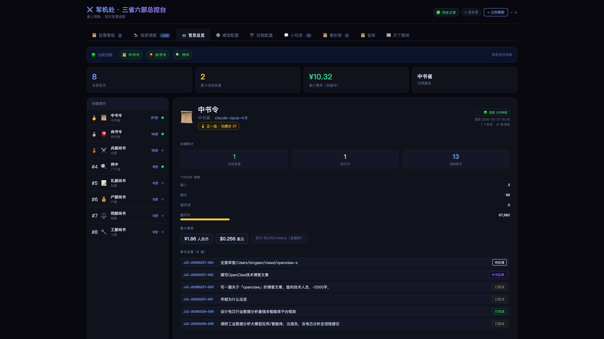
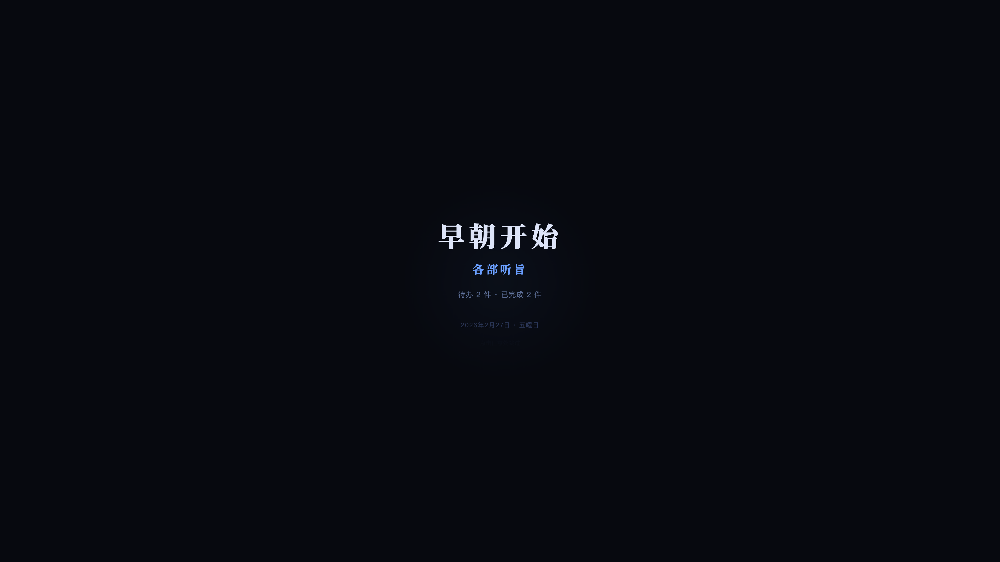

<h1 align="center">⚔️ Edict · Multi-Agent Orchestration</h1>

<p align="center">
  <strong>I rebuilt AI multi-agent orchestration as a shipboard systems control stack.<br>What matters is not more agents, but explicit review, routing, and observability.</strong>
</p>

<p align="center">
  <sub>12 AI agents form the Shipboard Systems: Yunxiao triages, Xingshu plans, Lengjing reviews, Zhongji dispatches, and specialist nodes execute.<br>Built-in <b>review gates</b> that CrewAI doesn't have, plus a <b>real-time dashboard</b> that AutoGen doesn't have.</sub>
</p>

<p align="center">
  <a href="#-demo">🎬 Demo</a> ·
  <a href="#-quick-start">🚀 Quick Start</a> ·
  <a href="#-architecture">🏛️ Architecture</a> ·
  <a href="#-features">📋 Features</a> ·
  <a href="README.md">中文</a> ·
  <a href="README_JA.md">日本語</a> ·
  <a href="CONTRIBUTING.md">Contributing</a>
</p>

<p align="center">
  
  
  
  
  
  
</p>

<p align="center">
  
</p>

---

## 🎬 Demo

<p align="center">
  <video src="docs/Agent_video_Pippit_20260225121727.mp4" width="100%" autoplay muted loop playsinline controls>
    Your browser does not support video playback. See the GIF below or <a href="docs/Agent_video_Pippit_20260225121727.mp4">download the video</a>.
  </video>
  <br>
  <sub>🎥 Full demo: AI Multi-Agent collaboration with Shipboard Systems</sub>
</p>

<details>
<summary>📸 GIF Preview (loads faster)</summary>
<p align="center">
  
  <br>
  <sub>Issue command → Yunxiao triage → Planning → Review → Execution Cluster runs → Return signal (30s)</sub>
</p>
</details>

> 🐳 **No OpenClaw?** Run `docker run -p 7891:7891 cft0808/edict-demo` to try the full dashboard with simulated data.

---

## 💡 The Idea

Most multi-agent frameworks let AI agents talk freely, producing opaque results you can't audit or intervene in. **Edict** takes a different approach: a layered command chain with explicit review and dispatch.

```
You (Owner) → Yunxiao (Triage) → Xingshu → Prism → Relay → Execution Cluster → Report Back
   主人              云霄               星枢          棱镜         中继           执行节点          回传
```

This isn't a cute metaphor. It's **real separation of powers** for AI:

- **Yunxiao (云霄)** triages messages — casual chat gets auto-replied, real commands become tasks
- **Planning (星枢)** breaks your command into actionable sub-tasks
- **Review (棱镜)** audits the plan — can reject and force re-planning
- **Dispatch (中继)** assigns approved tasks to specialist ministries
- **Execution Modules** execute in parallel, each with distinct expertise
- **Data sanitization** auto-strips file paths, metadata, and junk from task titles
- Everything flows through a **real-time dashboard** you can monitor and intervene

---

## 🤔 Why Edict?

> **"Instead of one AI doing everything wrong, 9 specialized agents check each other's work."**

| | CrewAI | MetaGPT | AutoGen | **Edict** |
|---|:---:|:---:|:---:|:---:|
| **Built-in review/veto** | ❌ | ⚠️ | ⚠️ | **✅ Dedicated reviewer** |
| **Real-time Kanban** | ❌ | ❌ | ❌ | **✅ 10-panel dashboard** |
| **Task intervention** | ❌ | ❌ | ❌ | **✅ Stop / Cancel / Resume** |
| **Full audit trail** | ⚠️ | ⚠️ | ❌ | **✅ Command archives** |
| **Agent health monitoring** | ❌ | ❌ | ❌ | **✅ Heartbeat detection** |
| **Hot-swap LLM models** | ❌ | ❌ | ❌ | **✅ From the dashboard** |
| **Skill management** | ❌ | ❌ | ❌ | **✅ View / Add skills** |
| **News aggregation** | ❌ | ❌ | ❌ | **✅ Daily digest + webhook** |
| **Setup complexity** | Med | High | Med | **Low · One-click / Docker** |

> **Core differentiator: Institutional review + Full observability + Real-time intervention**

<details>
<summary><b>🔍 Why the "Prism" is the killer feature (click to expand)</b></summary>

<br>

CrewAI and AutoGen agents work in a **"done, ship it"** mode — no one checks output quality. It's like a company with no QA department where engineers push code straight to production.

Edict's **Prism (棱镜)** exists specifically for this:

- 📋 **Audit plan quality** — Is the Xingshu's decomposition complete and sound?
- 🚫 **Veto subpar output** — Not a warning. A hard reject that forces re-planning.
- 🔄 **Mandatory rework loop** — Nothing passes until it meets standards.

This isn't an optional plugin — **it's part of the architecture**. Every command must pass through Review. No exceptions.

This is why Edict produces more reliable results on complex tasks: nothing reaches execution without a mandatory quality gate.

</details>

---

## ✨ Features

### 🏛️ Twelve-Node Agent Architecture
- **Yunxiao** (云霄) message triage — auto-reply casual chat, create tasks for real commands
- **Core Chain** (Yunxiao · Xingshu · Lengjing · Zhongji) for triage, planning, review, and dispatch
- **Execution Cluster** (Yuanliu · Wenshu · Weikong · Tanzhen · Jiwu · Xulie + Tianyan) for specialist execution
- Strict permission matrix — who can message whom is enforced
- Each agent: own workspace, own skills, own LLM model
- **Data sanitization** — auto-strips file paths, metadata, invalid prefixes from titles/remarks

### 📋 Command Center Dashboard (10 Panels)

| Panel | Description |
|-------|------------|
| 📋 **Edicts Kanban** | Task cards by state, filters, search, heartbeat badges, stop/cancel/resume |
| 🔭 **Node Monitor** | Pipeline visualization, distribution charts, health cards |
| 📜 **Command Archives** | Auto-generated archives with 5-phase timeline |
| 📜 **Edict Templates** | 9 presets with parameter forms, cost estimates, one-click dispatch |
| 👥 **Node Overview** | Token leaderboard, activity stats |
| 📰 **Daily Briefing** | Auto-curated news, subscription management, Feishu push |
| ⚙️ **Model Config** | Per-agent LLM switching, automatic Gateway restart |
| 🛠️ **Skills Config** | View installed skills, add new ones |
| 💬 **Sessions** | Live session monitoring with channel labels |
| 🎬 **Boot Sequence** | Immersive daily opening animation with stats |

---

## 🖼️ Screenshots

### Edicts Kanban


<details>
<summary>📸 More screenshots</summary>

### Agent Monitor


### Task Detail


### Model Config


### Skills


### Node Overview


### Sessions


### Archives Archive


### Command Templates


### Daily Briefing


### Boot Sequence


</details>

---

## 🚀 Quick Start

### Docker

```bash
docker run -p 7891:7891 cft0808/edict-demo
```
Open http://localhost:7891

### Full Install

**Prerequisites:** [OpenClaw](https://openclaw.ai) · Python 3.9+ · macOS/Linux

```bash
git clone https://github.com/muqing-kg/edict.git
cd edict
chmod +x install.sh && ./install.sh
```

The installer automatically:
- Creates workspaces for all nodes (`~/.openclaw/workspace-*`, including Yunxiao/Xulie/Tianyan)
- Writes SOUL.md personality files for each node
- Registers agents + permission matrix in `openclaw.json`
- Initializes data directory + first sync
- Restarts Gateway

### Launch

```bash
# Terminal 1: Data sync loop (every 15s)
bash scripts/run_loop.sh

# Terminal 2: Dashboard server
python3 dashboard/server.py

# Open browser
open http://127.0.0.1:7891
```

> 📖 See [Getting Started Guide](docs/getting-started.md) for detailed walkthrough.

### Uninstall

If you want to roll back the OpenClaw runtime installed by this project, stop local processes such as `bash scripts/run_loop.sh` and `python3 dashboard/server.py` first, then run:

```bash
./uninstall.sh
```

On Windows PowerShell:

```powershell
.\uninstall.ps1
```

The uninstall scripts will:
- Remove the non-`main` runtime node directories created by this project
- Restore the backed-up `main` entry `SOUL.md`
- Restore the backed-up `openclaw.json`
- Restart the OpenClaw Gateway if `openclaw` is available
- Keep the pre-install backup directory for manual inspection

> Uninstall only rolls back the OpenClaw runtime. It does not delete this repository directory.

> If you never installed via `./install.sh` or `./install.ps1`, and `~/.openclaw/jianzai-install-state.json` does not exist, the rollback cannot run automatically.

> Pre-install backups are kept under `~/.openclaw/backups/jianzai-install-*`.

---

## 🏛️ Architecture

```
                           ┌───────────────────────────────────┐
                           │         👑 Owner (You)           │
                           │     Feishu · Telegram · Signal     │
                           └─────────────────┬─────────────────┘
                                             │ Issue command
                           ┌─────────────────▼─────────────────┐
                           │     👑 Yunxiao (云霄)          │
                           │   Triage: chat → reply / cmd → task │
                           └─────────────────┬─────────────────┘
                                             │ Forward edict
                           ┌─────────────────▼─────────────────┐
                           │      📜 Xingshu (星枢)      │
                           │     Receive → Plan → Decompose      │
                           └─────────────────┬─────────────────┘
                                             │ Submit for review
                           ┌─────────────────▼─────────────────┐
                           │       🔍 Prism (棱镜)       │
                           │     Audit → Approve / Reject 🚫     │
                           └─────────────────┬─────────────────┘
                                             │ Approved ✅
                           ┌─────────────────▼─────────────────┐
                           │      📮 Relay (中继)      │
                           │   Assign → Coordinate → Collect     │
                           └───┬──────┬──────┬──────┬──────┬───┘
                               │      │      │      │      │
                         ┌─────▼┐ ┌───▼───┐ ┌▼─────┐ ┌───▼─┐ ┌▼─────┐
                         │💰 Fin.│ │📝 Docs│ │⚔️ Eng.│ │⚖️ Law│ │🔧 Ops│
                         │ 源流  │ │ 文枢  │ │ 维控  │ │ 探针 │ │ 机务  │
                         └──────┘ └──────┘ └──────┘ └─────┘ └──────┘
                                                               ┌──────┐
                                                               │📋 HR  │
                                                               │ 序列  │
                                                               └──────┘
```

### Agent Roles

| Dept | Agent ID | Role | Expertise |
|------|----------|------|-----------|
| 👑 **Yunxiao** | `main` | Triage, summarize | Chat detection, intent extraction |
| 📜 **Planning** | `xingshu` | Receive, plan, decompose | Requirements, architecture |
| 🔍 **Review** | `lengjing` | Audit, gatekeep, veto | Quality, risk, standards |
| 📮 **Dispatch** | `zhongji` | Assign, coordinate, collect | Scheduling, tracking |
| 💰 **Finance** | `yuanliu` | Data, resources, accounting | Data processing, reports |
| 📝 **Documentation** | `wenshu` | Docs, standards, reports | Tech writing, API docs |
| ⚔️ **Engineering** | `weikong` | Code, algorithms, checks | Development, code review |
| ⚖️ **Compliance** | `tanzhen` | Security, compliance, audit | Security scanning |
| 🔧 **Infrastructure** | `jiwu` | CI/CD, deploy, tooling | Docker, pipelines |
| 📋 **HR** | `xulie` | Agent management, training | Registration, permissions |
| 🌅 **Briefing** | `tianyan` | Daily briefing, news | Scheduled reports, summaries |

### Permission Matrix

| From ↓ \ To → | Prince | Planning | Review | Dispatch | Ministries |
|:---:|:---:|:---:|:---:|:---:|:---:|
| **Yunxiao** | — | ✅ | | | |
| **Planning** | ✅ | — | ✅ | ✅ | |
| **Review** | | ✅ | — | ✅ | |
| **Dispatch** | | ✅ | ✅ | — | ✅ all |
| **Ministries** | | | | ✅ | |

### State Machine

```
Owner → Prince Triage → Planning → Review → Assigned → Executing → ✅ Done
                              ↑          │                       │
                              └── Veto ──┘              Blocked ──
```

---

## 📁 Project Structure

```
edict/
├── agents/                     # 12 agent personality templates (SOUL.md)
│   ├── main/                  #   Yunxiao (triage)
│   ├── xingshu/               #   Xingshu
│   ├── lengjing/                 #   Prism
│   ├── zhongji/               #   Relay
│   ├── yuanliu/ wenshu/ weikong/     #   Finance / Docs / Engineering
│   ├── tanzhen/ jiwu/         #   Compliance / Infrastructure
│   ├── xulie/                #   HR Dept
│   └── tianyan/                #   Morning Briefing
├── dashboard/
│   ├── dashboard.html          # Dashboard (single file, zero deps, works out of the box)
│   ├── dist/                   # Pre-built React frontend (included in Docker image)
│   └── server.py               # API server (stdlib, zero deps)
├── scripts/                    # Data sync & automation scripts
│   ├── kanban_update.py        #   Kanban CLI with data sanitization (~300 lines)
│   └── ...                     #   fetch_morning_news, sync, screenshots, etc.
├── tests/                      # E2E tests
│   └── test_e2e_kanban.py      #   Kanban sanitization tests (17 assertions)
├── data/                       # Runtime data (gitignored)
├── docs/                       # Documentation + screenshots
├── install.sh                  # One-click installer
└── LICENSE                     # MIT
```

---

## 🔧 Technical Highlights

| | |
|---|---|
| **React 18 Frontend** | TypeScript + Vite + Zustand, 13 components |
| **stdlib Backend** | `server.py` on `http.server`, zero dependencies |
| **Agent Thinking Visible** | Real-time display of agent thinking, tool calls, results |
| **One-click Install** | Workspace creation to Gateway restart |
| **15s Auto-sync** | Live data refresh with countdown |
| **Daily Boot Sequence** | Immersive opening animation |

---

## 🗺️ Roadmap

> Full roadmap with contribution opportunities: [ROADMAP.md](ROADMAP.md)

### Phase 1 — Core Architecture ✅
- [x] Twelve-node agent architecture + permissions
- [x] Yunxiao triage layer (chat vs task auto-routing)
- [x] Real-time dashboard (10 panels)
- [x] Task stop / cancel / resume
- [x] Command archives (5-phase timeline)
- [x] Edict template library (9 presets)
- [x] Boot sequence animation
- [x] Daily news + Feishu webhook push
- [x] Hot-swap LLM models + skill management
- [x] Node overview + token stats
- [x] Session monitoring
- [x] Edict data sanitization (title/remark cleaning, dirty data rejection)
- [x] Duplicate task overwrite protection
- [x] E2E kanban tests (17 assertions)

### Phase 2 — Institutional Depth 🚧
- [ ] Human approval mode
- [ ] Merit/demerit ledger (agent scoring)
- [ ] Express courier (inter-agent message visualization)
- [ ] Knowledge archive (knowledge base + citation)

### Phase 3 — Ecosystem
- [ ] Docker Compose + demo image
- [ ] Notion / Linear adapters
- [ ] Annual review (yearly performance reports)
- [ ] Mobile responsive + PWA
- [ ] ClawHub marketplace listing

---

## 🤝 Contributing

All contributions welcome! See [CONTRIBUTING.md](CONTRIBUTING.md)

- 🎨 **UI** — themes, responsiveness, animations
- 🤖 **New agents** — specialized roles
- 📦 **Skills** — node-specific packages
- 🔗 **Integrations** — Notion · Jira · Linear · GitHub Issues
- 🌐 **i18n** — Japanese · Korean · Spanish
- 📱 **Mobile** — responsive, PWA

---

## � Examples

The `examples/` directory contains real end-to-end use cases:

| Example | Command | Nodes |
|---------|---------|-------------|
| [Competitive Analysis](examples/competitive-analysis.md) | "Analyze CrewAI vs AutoGen vs LangGraph" | Planning→Review→Finance+Engineering+Docs |
| [Code Review](examples/code-review.md) | "Review this FastAPI code for security issues" | Planning→Review→Engineering+Compliance |
| [Weekly Report](examples/weekly-report.md) | "Generate this week's engineering team report" | Planning→Review→Finance+Docs |

Each case includes: Full command → Planning proposal → Review feedback → Node outputs → Final report.

---

## 📄 License

[MIT](LICENSE) · Built by the [OpenClaw](https://openclaw.ai) community

---

## 📮 WeChat · Behind the Scenes

> *Architecture notes, build logs, and workflow experiments are posted on the WeChat account below.*

<p align="center">
  
  <br>
  <b>Scan to follow · cft0808</b>
</p>

What you’ll find:
- 🏛️ Architecture deep-dives — how 12 agents achieve separation of powers
- 🔥 War stories — when agents fight, burn tokens, or go on strike
- 💡 Token-saving tricks — run the full pipeline at 1/10 the cost
- 🎭 Behind the SOUL.md — how to write prompts that make AI agents stay in character

---

## ⭐ Star History

[](https://star-history.com/#muqing-kg/edict&Date)

---

<p align="center">
  <strong>⚔️ Governing AI with the wisdom of ancient empires</strong><br>
  <sub>以古制御新技，以智慧驾驭 AI</sub><br><br>
  <a href="#-wechat--behind-the-scenes"></a>
</p>
